# CS464 Assignment 01 · Saleh bint e Bilal · BSSE23081
## Game 1 · Subway Surfers
- **Store link:** https://apps.apple.com/pk/app/subway-surfers/id512939461
- **Genre:** Endless runner (arcade)
- **I played:** subway surfers for over an hour, collected around 20k coins and a high score of 200k
- **Video (optional):** [YouTube (unlisted) or Google Drive link]

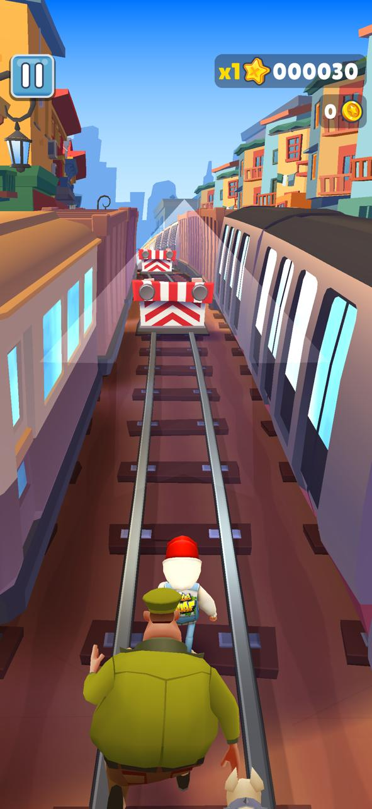
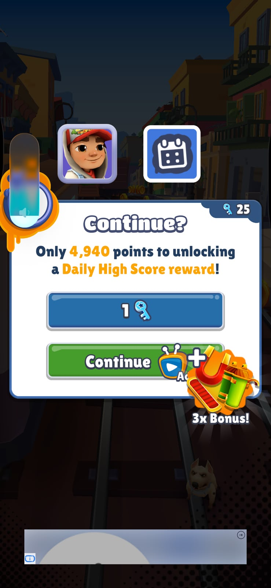
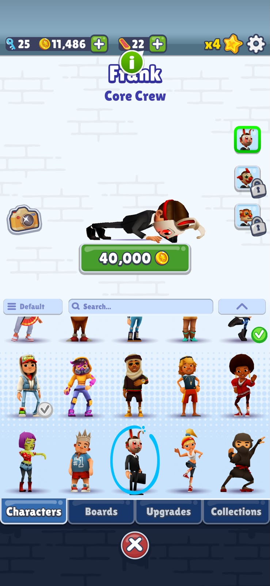
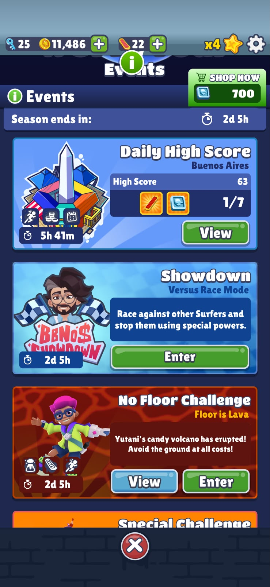
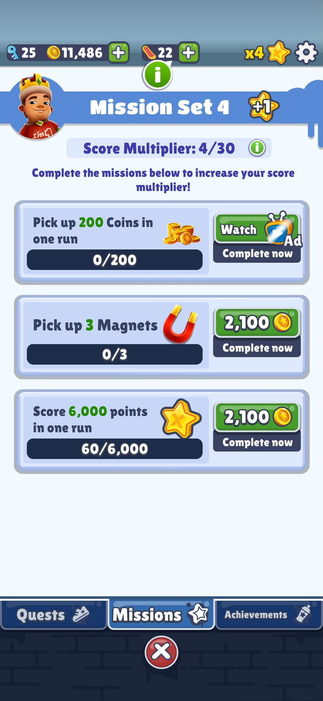
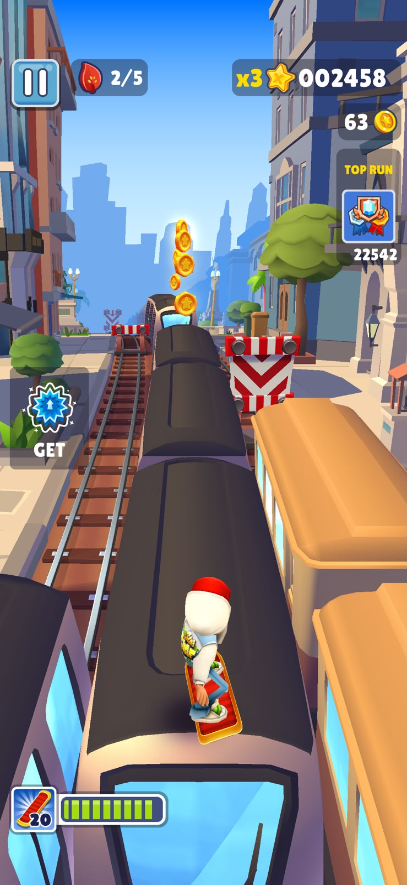
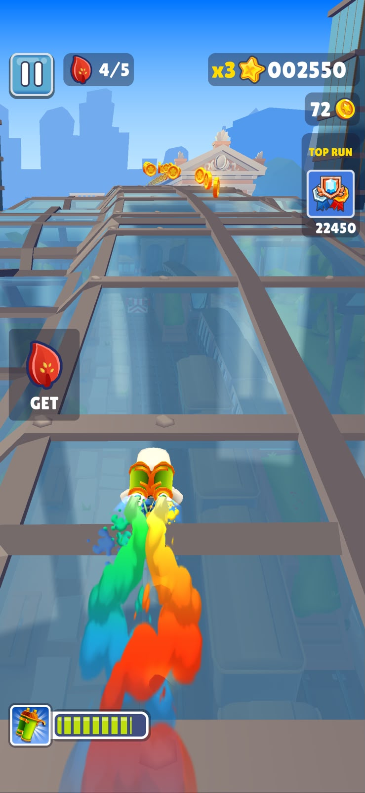

1. [M1] · [shows the gameplay where trains and other obstacles are shown where you swipe to dodge them]
2. [M2] · [shows a pop up seen after a crash where you have an option to continue the run using keys or adds]
3. [M3] · [shows the character shop which shows the different characters and how much they cost]
4. [M4] · [shows different challenges in the world tour, for example the longest played, and challenges relating other players]
5. [M5] · [shows different missions that can boost your score multiplier]
6. [M6] · [shows the character riding a hoverboard]
7. [M7] · [shows the player in the sky with the jetpack on]
| # | Mechanic | Dynamic | Aesthetic | Bartle type |
|---|---|---|---|---|
| M1 |Swipe left or right to change lane, up to jump, down to roll|Players leave the lane switch until the last moment to catch a coin line|Challenge, a reflex obstacle course where one late swipe ends the run|Achiever, you beat the track on its own terms|
| M2 |a crash ends the run and a single tap starts a new one|After each run, you want to start another run to beat your last score or collect more coins|Submission, restarting instantly is the pastime loop|Achiever, to have a better score|
| M3 |Coins collected during a run are spent in the shop on characters and boards|Players keep starting new runs after a crash to afford the next character or board they want|Expression, choosing who you run as makes the game feel more personal|Achiever, a collection to complete|
| M4 |In the World Tour, your best score in a challenge is ranked against players worldwide|Players replay the same challenge to push their rank up, and come back when the event resets, some challenges like 'showdown' interact directly with other players|Challenge: a rank gives every run a measurable target, so beating your own best isn't enough.|Killer, since you directly interact with other players and affect their gameplay|
| M5 |completing a set of missions raises the score multiplier by one|Players steer toward mission tokens even on routes where a crash is more likely|Challenge, because chasing a token means risking the run|Achiever, you follow the game rules to complete missions|
| M6 |Hoverboard is activated by double tapping the screen and it absorbs a crash for a short time|when you find a patch of the run too hard, you activate the hoverboard|Submission, lowers the pressure so you can play half-focused for a few seconds|Achiever, hoverboard is a tool for getting further|
| M7 |A jetpack pickup lifts you above the track for a few seconds, with no obstacles and a path of coins|you go for a jetpack to have a easier patch in the game without obstacles and collect coins|Sensation, the trail of coins and no obstacle gives a pleasure sense|Achiever, the coins add to your score and the shop|
**Aesthetic profile:**Challenge, Expression and Submission.
 Challenge leads (M1, M4, M5): every run can end on one mistake, a rank gives each run a target, and chasing mission tokens means risking the run.
 Submission keeps me replaying (M2, M6): restarting takes one tap, and the hoverboard lets me play half-focused for a few seconds.
 Expression (M3) comes from spending coins to choose who I run as.
**Player types**
- Primary: [Achiever] ([acting] × [world]), because [M1, M2, M3, M5, M6 and M7: the coins, missions, score multiplier and power-ups all give me something to beat or collect on the game's own terms.]
- Secondary: [Killer] ([acting] × [players]), because [M4: the World Tour ranks me against players worldwide. It's a mild fit, since I only affect others by passing them in the ranking, and Subway Surfers is mainly an Achiever game.]

## Level blockouts
| Level | Screenshot | Its idea | Wayfinding tool |
|---|---|---|---|
| Level01 | 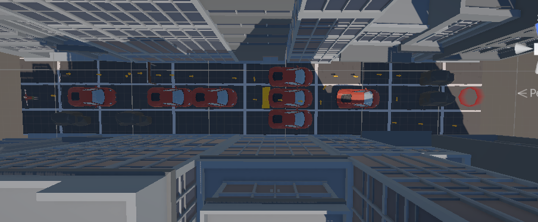 |Lane weaving: low cover blocks a different lane every few metres, so the player has to switch lanes to get through|Leading lines: contrasting arrows run from the doorway to the goal|
| Level02 | 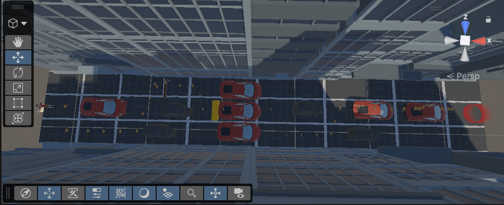 |Tempting risk: a safe route versus a shorter route, with the risky one rewarded by coins|Breadcrumbs: a trail of small yellow coin stars leads along the risky path.|
| Level03 |  |Gaps and height: a jump gap of 3 m or less, then a platform at a different height|Landmark: a car beyond the gap marks the goal|
| Level04 |  |Skyway: an elevated, obstacle-free route with a coin path, against a harder ground route|Light and contrast: the high route is a bright colour and the ground route is dull|
| Level05 |  |Combination: a lane section, a narrow doorway that opens into the further path|Pinch and release: a doorway opens into the yard with the path in view|

## Game 2 · Color or Die, a game in roblox
- **Store link:** roblox: https://apps.apple.com/pk/app/roblox/id431946152
game: https://www.roblox.com/share?code=ab49f11bcf00ee46b23be75a223d8e39&type=ExperienceDetails&stamp=1790961416242
- **Genre:** Horror survival / maze escape (Roblox experience)
- **I played:** this game for over 3 hours, collected 10 brushes in total, after that got caught
- **Video (optional):** [YouTube (unlisted) or Google Drive link]

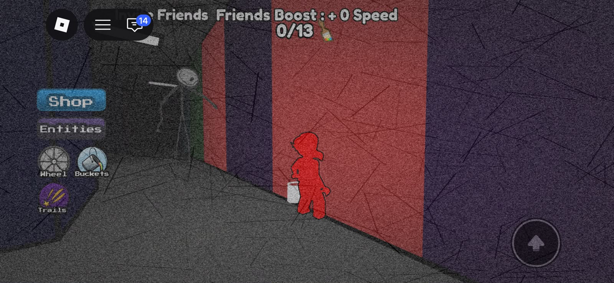
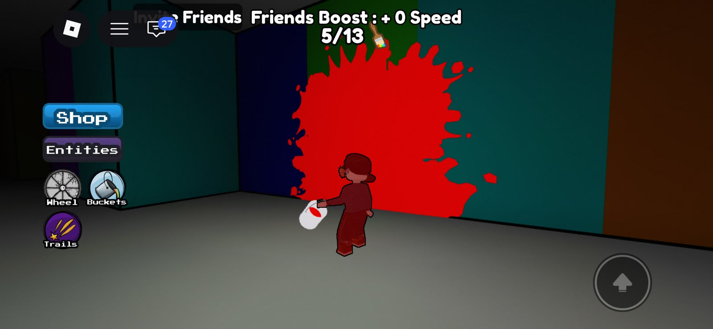
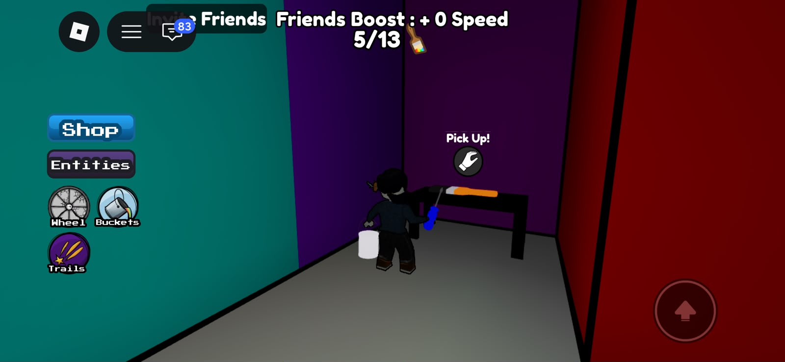
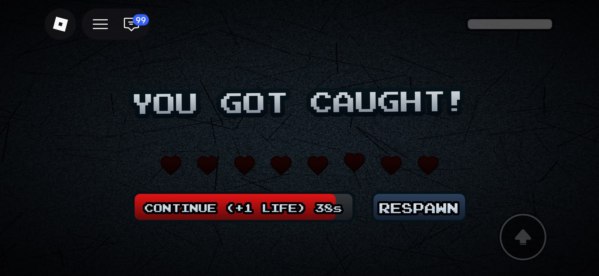
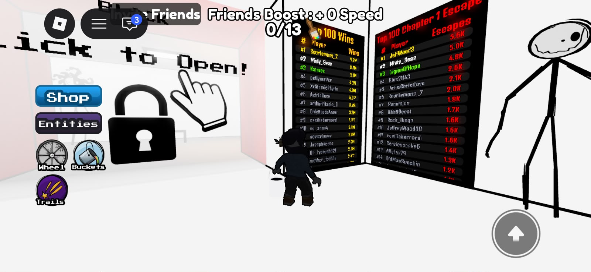
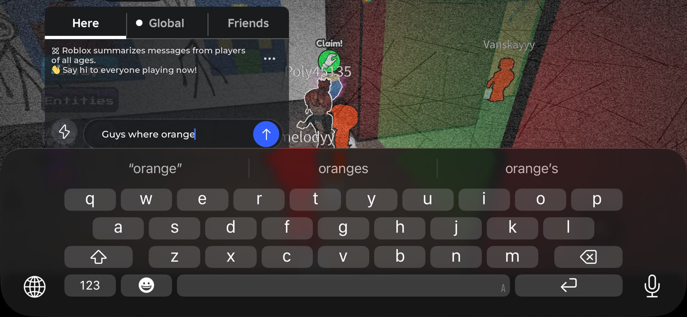

1. [M1] · [shows the player colored in red, hiding from the monster in a red section of the wall]
2. [M2] · [shows the player throwing red paint on the red bucket]
3. [M3, M6] · [shows a screen with the player and on top the brush count and friendship boost being shown]
4. [M4] · [shows the screen where after you're caught by the monster, there is a revival option]
5. [M5] · [shows two leadership boards in front of the player where the top most player ids are shown]
7. [M7] · [shows a screen with the text pop up, and the player asking the chat about the orange room]
| # | Mechanic | Dynamic | Aesthetic | Bartle type |
|---|---|---|---|---|
| M1 |If your character's colour matches the wall you're standing at, the monster can't see you. The screen tints and a sound plays when it's close.|Players ran to the nearest wall of their colour and waited there until the monster moved away|Challenge: you have to read the warning and reach the right wall in time, or you get caught|Explorer, you're working with a rule of the maze, not beating a score|
| M2 |You carry a bucket to the matching gate in the maze and click it about 4 times to throw paint on it. The gate then opens to a brush, a paint bucket or a new obby|Players stand at the gate watching for the monster while they click, and break off to hide when it gets close|Challenge: you're exposed while you click, so every gate is a risk|Achiever, you impose paint on the gate to open it, and each one moves you toward the 13 brushes|
| M3 |A counter at the top of the screen tracks the brushes you've collected out of 13|Players checked the counter and searched the rooms for the brushes they were missing|Discovery: brushes are scattered through the maze, so each one is something you find|Achiever, a target of 13 to complete on the game's own terms|
| M4 |When the monster catches you, a "Continue (+1 life)" button appears with a 60 s countdown, and it costs Robux, which is bought with real money. The other option is Respawn|Players decide within seconds whether to pay to keep their progress or respawn and lose it|Challenge: failure has stakes, and the countdown makes you weigh them quickly|Achiever, paying keeps you moving toward finishing the chapter on the game's own terms|
| M5 |Two leaderboards rank players by total wins and by chapter 1 escapes|Players replayed the chapter to climb the rankings and compared themselves with friends|Challenge, a rank gives every escape a measurable target|Killer, mild, the only player-facing ranking, but you only affect others by passing them|
| M6 |Each friend who joins your run adds a speed bonus|Players invite friends or join theirs so they can run faster from the lobby on|Fellowship: playing together makes the run easier, so the group is the reward|Socializer, the game gives you a reason to bring other people|
| M7 |A text chat lets players on the same server message each other|Players ask where a gate or item is, and others tell them, so people with more experience guide newer ones|Fellowship: strangers help each other get through the maze|Socializer, the chat exists for people to talk to each other.
**Aesthetic profile:**
Challenge leads (M1, M2, M4, M5): the monster can catch you while you hide or click at a gate, a catch can cost you your progress unless you pay to continue, and the leaderboards rank every escape. Fellowship comes next (M6, M7): friends speed up your run, and strangers use the chat to help each other find things. Discovery (M3) is a smaller part, from searching the maze for the 13 brushes.
**Player types**
- Primary: [Achiever] ([acting] × [world]), because [M2, M3 and M4: opening gates, collecting 13 brushes and pushing through a chapter are all things to beat on the game's own terms.]
- Secondary: [Socializer] ([interacting] × [players]), because [M6 and M7: the friends boost gives me a reason to bring people along, and the chat is how players help each other.]